 

> **Nguyễn Đức Toàn** — Information Technology student at **UET**, working across software engineering, cybersecurity, GIS, computer vision and AI-assisted development workflows.
>
> My focus is building **practical systems instead of isolated demos**: tools that can be tested, improved, documented and reused.

 

  
  
  
  

<b>Read the directions as plain text</b>

- **Software Engineering** — web applications with live deployments; automation with Git, GitHub Actions and CI gates; clean repositories, ADRs, documentation and reproducible setup; JavaScript, TypeScript, Python, PowerShell, Java and C/C++.
- **Cybersecurity** — CTF writeups across cryptography, forensics and web; vulnerability evidence from CISA KEV, NVD, OSV and MITRE ATT&CK; cryptography analysis, especially RSA-based challenges. Long-term direction: applied cybersecurity and security engineering.
- **GIS & Computer Vision** — 360° imagery anchored on reconstructed historical maps; VN-2000 → WGS84 coordinate transforms; QGIS / PyQGIS automation and GeoTIFF workflows; object detection from UAV or satellite imagery.
- **AI-Assisted Development** — Windows-native multi-agent orchestration; chief / worker agents with cost-aware reasoning; the repository as persistent project memory with ADR-driven decisions; local models with Ollama where practical.

 

  
  
  
  

<b>Read the projects as plain text</b>

- **[Vauban Hanoi 360°](https://vauban-hanoi.vercel.app/)** — a Web GIS tour of five Vauban-style citadels around Hanoi. 37 panoramas are placed on a reconstructed map, and the view fan on the map turns with the panorama so you always know where you stand and which way you face. MAP, SPLIT and 360° modes, mobile layout, shareable scene links. Citadel geometry converted from VN-2000 to WGS84.
- **CyberSecurity Evidence Observatory** — the initial architecture of a research-grade platform for collecting and analysing cybersecurity evidence. Hourly, deterministic ingestion from authoritative sources (CISA KEV, NVD, OSV, GitHub Security Advisories, MITRE CWE / CAPEC / ATT&CK) with preserved provenance. Retrieved content is always treated as untrusted data, and nothing passes without validation.
- **AI Company** — a Windows-native multi-agent AI company orchestration platform. A chief agent plans, a worker fleet executes, and every milestone passes a gate backed by local CI evidence. Architecture decisions are recorded as ADRs, and the repository is the persistent memory.
- **[Capture The Flag](https://github.com/KidouNguyen25/Capture-The-Flag)** — picoCTF 2024 solutions across cryptography, forensics and web, each with a README, a SOLUTION write-up and a reproducible data-fetch script.

 

 

 

> This account is a technical record of growth: coursework, research, prototypes, experiments and production-ready tools.
> The goal is not to collect unfinished repositories — it is to build systems that **survive review, testing, refactoring and real use.**

