

<a href="https://kidounguyen25.github.io/KidouNguyen25/">
  
</a>

 


> **Nguyễn Đức Toàn** — Information Technology student at **UET**, working across software engineering, cybersecurity, GIS, computer vision and AI-assisted development workflows.
>
> My focus is building **practical systems instead of isolated demos**: tools that can be tested, improved, documented and reused.

 


  
  
  
  

<b>Read the directions as plain text</b>

- **Software Engineering** — web applications and deployable GitHub projects; automation with Git, GitHub Actions and structured development loops; clean repository organization, documentation and repeatable setup; Java, Python, C/C++, JavaScript and TypeScript.
- **Cybersecurity** — CTF practice and security coursework; cryptography analysis, especially RSA-based challenges; secure development habits, reproducible reports and technical writeups. Long-term direction: applied cybersecurity and security engineering.
- **GIS & Computer Vision** — QGIS automation and PyQGIS tools; raster processing, GeoTIFF workflows and georeferencing; object detection from UAV or satellite imagery; aquaculture cage / fish raft detection with YOLO-style models; export to SHP and GeoPackage.
- **AI-Assisted Development** — AI agent workflows for software development; local models with Ollama; Antigravity / agent-based project execution; project memory systems and context-efficient rules; subagent-style planning, implementation, review and testing loops.

 


  
  
  
  

<b>Read the projects as plain text</b>

- **Asteria Academies** — a 3D educational math game inspired by maze exploration, academy cities and logic puzzles. Grade 6 and Grade 7 as separate academy worlds, puzzles from basic curriculum to olympiad-style reasoning, aligned with Vietnamese education content, browser-based with a strong focus on correctness, playable loops and mobile usability.
- **GIS Detection Workflows** — detecting aquaculture cages and floating raft structures from raster imagery. Better preprocessing before AI detection, detection as the final step rather than the whole solution, export of boxes, masks and boundaries to GIS formats, preserved spatial accuracy, QGIS integration.
- **GE Pro / QGIS Export Research** — exporting high-quality Google Earth Pro imagery with usable coordinates: capture or infer viewport coordinates, attach georeference data correctly, reduce manual correction, build a repeatable toolchain for QGIS users.
- **AI Project Memory System** — a GitHub-based structure for long-term memory per project: one memory space per project, compact context files for AI agents, reduced token usage, clear rules, changelogs, decisions and task history.

 



 



 


> This account is a technical record of growth: coursework, research, prototypes, experiments and production-ready tools.
> The goal is not to collect unfinished repositories — it is to build systems that **survive review, testing, refactoring and real use.**

